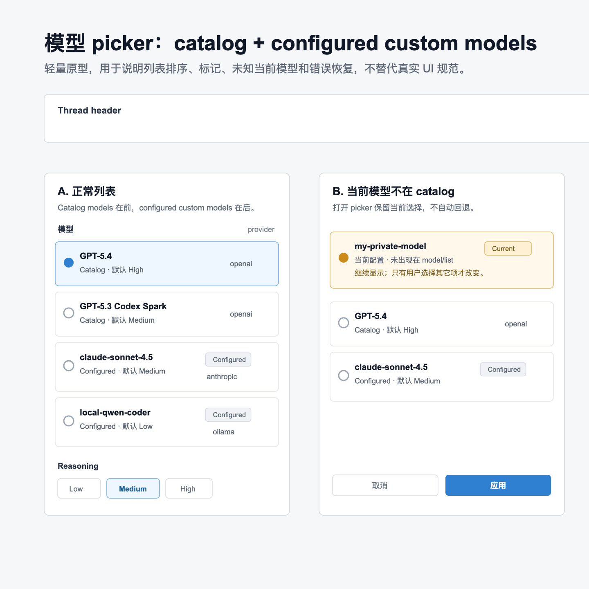

# 自定义模型 Picker 设计 Brief

## 产品目标

让 root-worker prototype 的运行配置 picker 不只显示 catalog 返回的内置模型，也能显示当前配置中已有的自定义 provider/model。用户打开 picker 时应理解每个模型来自哪里，并且当前 thread 的模型不会因为不在 catalog 中而被自动回退。

## 目标用户

- 角色：my-codex / root-worker prototype 的日常开发、调试和 dogfood 用户。
- 使用频率：模型切换中低频，但识别当前配置高频。
- 设备：桌面端 Electron，键鼠为主，偶尔需要键盘导航。
- 专业程度：理解 model/provider/config，但不应被 raw config 字段打断主任务。

## 范围

- 涉及页面：`apps/root-worker-prototype` 当前 thread header 的 `RunConfigPicker`。
- 涉及状态：catalog model、configured custom model、当前 model 不在 catalog、加载、错误、空结果、turn running。
- 非目标：不设计全局 provider 管理页，不支持编辑 config.toml，不设计认证流程，不改变运行配置 picker 的整体信息架构。

## 约束

- 保持现有浅色、紧凑、工具型 UI；不做大改版。
- 继续以 `model/list` 作为 catalog 数据来源，避免前端写死内置模型。
- 自定义模型来自当前有效配置或 app-server 后续暴露的 configured model/provider 数据；前端只做展示和选择。
- 打开 picker 时创建草稿，不直接修改当前 thread。
- 当前 model 不在 catalog 时，必须保留为可见首项；不能在打开 picker 时自动选择默认 catalog model。
- 文档和交付物使用中文，专业名词保留英文。

## Baseline

本设计涉及 root-worker prototype 客户端 UI。固定环境为：

- `CODEX_HOME=/tmp/my-codex-root-worker-ui-env/codex-home`
- `ROOT_WORKER_WORKSPACE=/tmp/my-codex-root-worker-ui-env/workspace`

本次沿用相邻设计任务已在同一 worktree、同一固定环境获取的当前应用 baseline，作为现有布局基线；未重新设计主界面布局：

## 原型资产

低保真状态原型：

该图只表达 picker 状态与列表语义，不替代 `04-components.md` 中的字段、文案、排序和可访问性规范。可编辑源文件保留在 `assets/custom-models-picker-states.svg`。

## 验收标准

- catalog model 与 configured custom model 能在同一列表中展示，并用 provider 名和 `Configured` 标记区分来源。
- 当前 model 不在 catalog 时仍显示为当前项，打开 picker 不自动回退。
- 用户只有点击其它模型并点击 `应用` 后，才改变当前 thread 后续消息的运行配置。
- 加载、错误、空结果均说明“当前配置未受影响”。
- running turn 可打开 picker 查看，但 `应用` 禁用并有文本原因。
- 组件 handoff 覆盖字段、文案、排序、空状态、交互风险。
