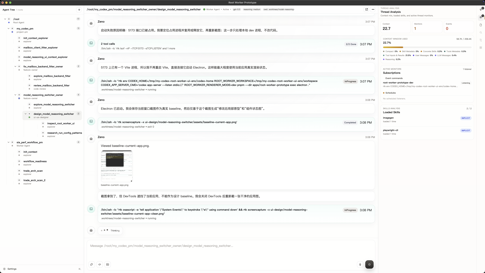
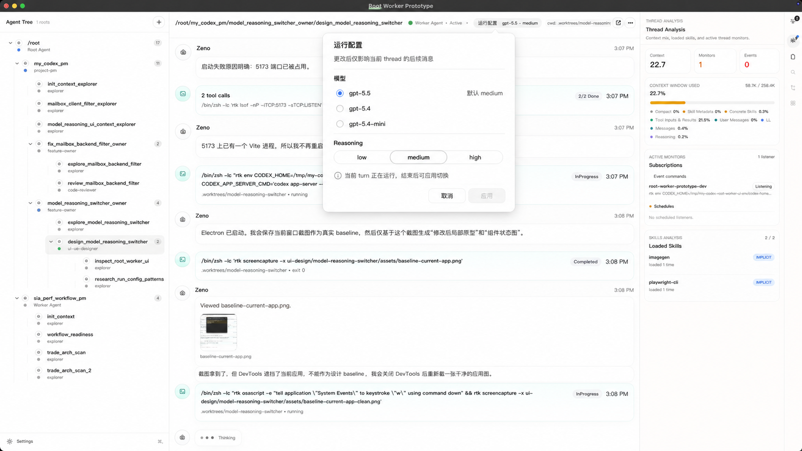
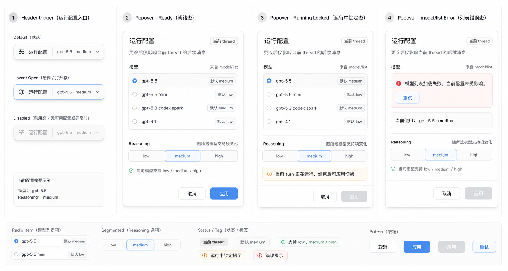

# 运行配置切换设计 Brief

## 产品目标

将 root-worker prototype 线程 header 中现有的静态 model / reasoning chip 改为可点击的“运行配置”入口。用户可以在当前 thread 内切换后续消息使用的 model 与 reasoning effort，同时清楚理解配置作用域、运行中限制和错误恢复方式。

## 目标用户

- 角色：my-codex / root-worker prototype 的日常开发与调试用户。
- 使用频率：高频，通常在一个 thread 中多次观察 agent 行为，但切换配置属于中低频操作。
- 设备：桌面端 Electron 客户端，键鼠操作为主。
- 专业程度：理解 model 与 reasoning，但不应被协议字段、provider 细节或持久化范围打断。

## 范围

- 涉及页面：`apps/root-worker-prototype` 当前 thread 主界面的 header 区域。
- 涉及入口：当前 header 的 model / reasoning chip 合并为“运行配置”按钮。
- 涉及浮层：紧凑 popover，包含 model 列表、reasoning 选项、作用域说明、应用/取消。
- 非目标：不设计全局设置页、不改历史 turn 展示、不设计 provider 账号管理、不修改业务代码。

## 约束

- 模型列表来自 app-server v2 `model/list`，前端不写死模型全集。
- Reasoning 选项跟随所选 model 的 `supportedReasoningEfforts`。
- 若新 model 不支持当前 effort，自动 fallback 到该 model 的 `defaultReasoningEffort`。
- 当前 turn 正在运行时不允许应用切换；允许打开查看配置，但主操作置灰并给清晰状态。
- `model/list` 错误必须可恢复，不能破坏当前 thread 已有 model / reasoning。
- UI 保持工具型、安静、紧凑，不做营销式页面或大卡片。
- 文档与交付物使用中文，专业名词可保留英文。

## Baseline

本设计涉及 root-worker prototype 客户端 UI，已按固定环境尝试获取 baseline：

- `CODEX_HOME=/tmp/my-codex-root-worker-ui-env/codex-home`
- `ROOT_WORKER_WORKSPACE=/tmp/my-codex-root-worker-ui-env/workspace`

Playwright 直连 Vite 页面得到空白画面，原因是浏览器直连缺少 Electron preload / app-server 状态上下文。随后通过固定环境启动 Electron，并使用系统截图取得当前真实应用 baseline：

## 原型资产

本次原型不使用完整想象应用图，只交付与功能修改直接相关的 bitmap：

两张图均由 imagegen 生成。第一张基于当前应用截图表达 header 入口与 popover 修改后的局部效果；第二张只覆盖功能相关组件状态。最终文案、状态和组件规则以 `02-ue-flow.md`、`04-components.md` 为准。

## 验收标准

- Header 入口能清楚表达当前配置摘要，例如 `运行配置 · GPT-5.4 · High`。
- Popover 默认说明“更改后仅影响当前 thread 的后续消息”。
- 模型列表加载、成功、错误、重试、空结果均有状态。
- Reasoning 只展示或启用所选 model 支持的 effort。
- 不支持当前 effort 时，界面明确回退到 model default effort。
- Running turn 中不能应用切换，且状态提示不依赖颜色。
- 键盘、焦点、屏幕阅读器语义可用。
