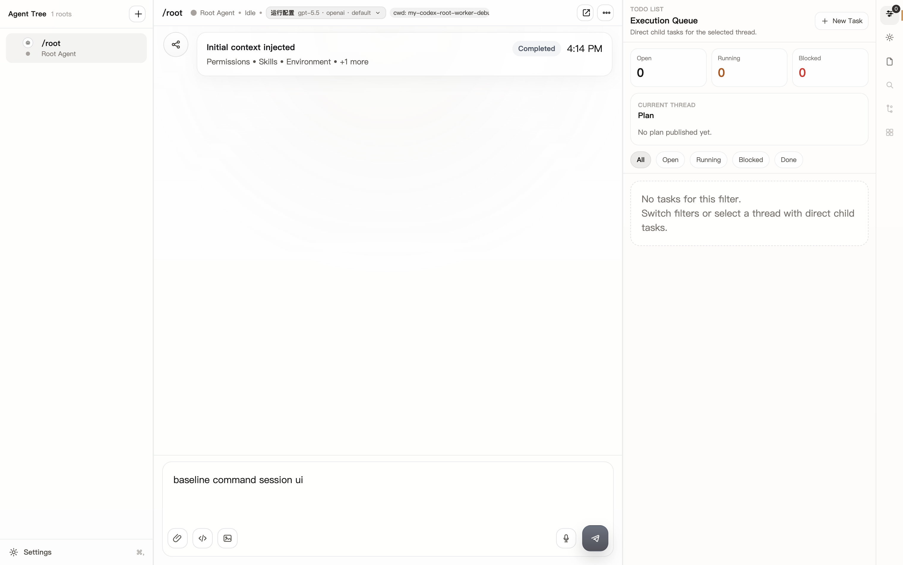

# Research

## 本次是否调研

未做外部产品调研。

原因：本次是现有 root-worker prototype 的 Command Session 展示修复，范围集中在 typed command cell、RightPanel live index、虚拟列表定位和 notification event 信息层级。设计依据来自当前完整 Electron baseline、现有前端组件结构和 typed `ThreadItem` 约束。

## Baseline 依据

## 相关内部模式

- Conversation 继续作为 canonical timeline。
- RightPanel 继续作为 live/recent activity index。
- typed item id 是跨 conversation 与 RightPanel 的唯一可靠关联键。
- 不从 raw marker、message text 或 JSON envelope 反解 UI 状态。

## Composer Slash 菜单轻量调研

本次做轻量模式调研，原因：slash 菜单是新输入模式，但仍复用现有 composer 和桌面键鼠交互。

参考产品模式：
- Notion：`/` 触发内容菜单，并可继续输入关键字缩小候选范围。参考：https://www.notion.com/help/keyboard-shortcuts
- Slack：在 message field 输入 `/` 或点击 slash icon 打开 shortcuts menu，输入名称筛选，选择后可继续补充参数或发送执行。参考：https://slack.com/help/articles/360057554553-Use-shortcuts-to-take-actions-in-Slack
- VS Code Quick Pick：命令/候选列表采用上下移动、确认选择、Esc 关闭的键盘优先模型。参考：https://code.visualstudio.com/docs/reference/default-keybindings

对 root-worker 的取舍：
- 采用 composer 锚定弹层，而不是全局 command palette，避免把日常消息输入切换成导航模式。
- 候选内容分为 `Commands` 和 `Skills`，用分组标题帮助用户判断选择后的后果。
- `Enter` 对内置命令是执行或提交该命令，对 Skill 走现有 chip/payload 行为；`Tab` 只做补全或选择，不自动发送普通消息。
- Slack 的发送模型不照搬到 root-worker；root-worker 内置命令必须走本地 command semantics，Skill 不因选择候选而自动发送。
- `/` 后继续输入即时过滤；没有匹配时保留 draft 并显示空态，不清空用户输入。
