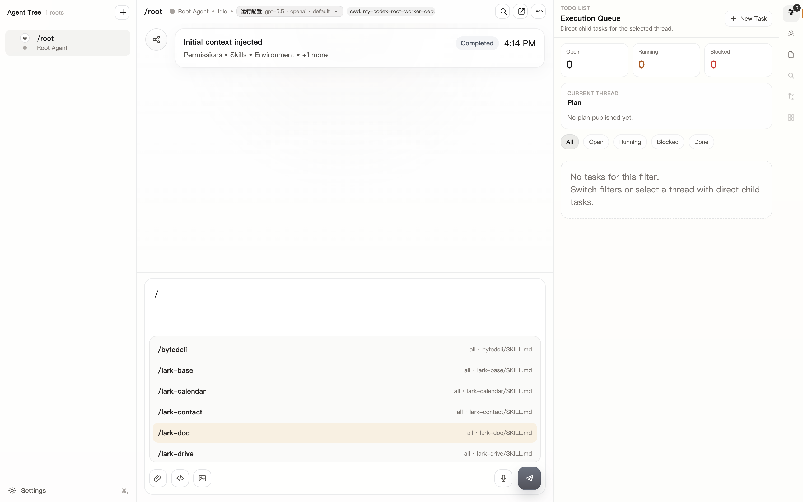
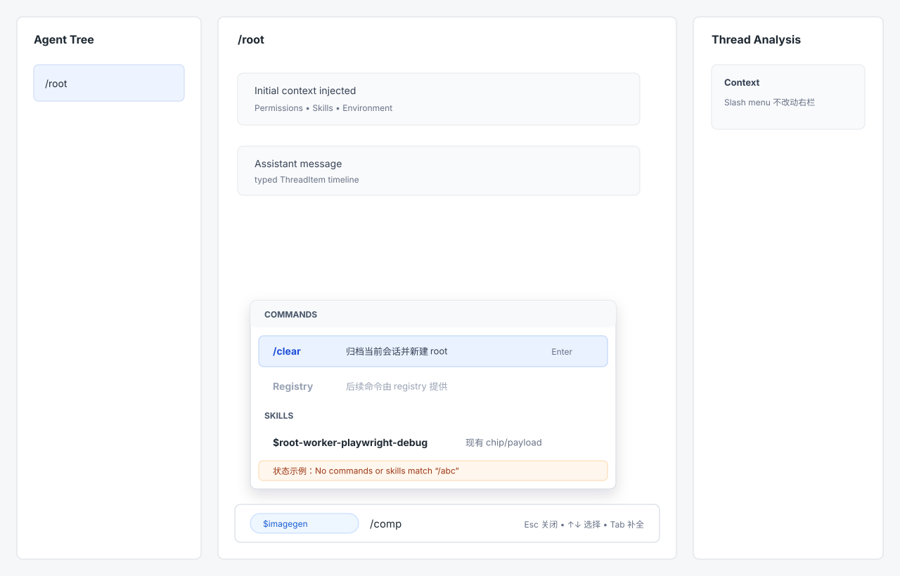

# Composer Slash 菜单设计 handoff

## 目标

让高频 root-worker 用户在 composer 内通过 `/` 快速发现并选择内置命令和 Skills，同时保留当前 draft 和键盘工作流。

## Baseline 与原型

真实 baseline 使用完整 Electron smoke 获取，不使用 Vite renderer 直开：

低保真原型：

结论：沿用现有 composer 和 Skills 弹层式候选列表，不新增全局页面或右栏模块。菜单只在输入态出现，关闭后不留下额外 UI。

## 候选分组

Commands：
- 展示当前已存在的内置命令，例如 `/clear`。后续其他命令应由命令 registry 提供，不作为本次新增范围。
- 每个候选必须绑定稳定 `commandId`；展示 token 只用于显示和补全。
- 候选说明写动作后果，不写实现细节。

本次最小命令清单：

| token | commandId | 参数 | 选择行为 | 菜单说明 |
| --- | --- | --- | --- | --- |
| `/clear` | `clear` | 无 | 立即执行当前 `/clear` 语义，归档当前 session threads 并创建新的 root thread；不作为普通用户消息发送 | 归档当前会话并新建 root |

Skills：
- 至少展示 `$skill-name`；说明仅在现有数据或后续 metadata 可用时展示。
- 选择、chip 展示和 payload 沿用当前已基本可用的实现，不因加入内置命令而改变。
- 已在 composer 中存在的同名 chip 如果当前实现已有处理则保持；本次不额外改变重复选择策略。

排序：
- 默认先 Commands 后 Skills。
- query 命中精确 token 的候选排在同组前列。
- 分组标题不可选，键盘导航跳过。

## 过滤与状态

过滤范围：token/name、alias、description。过滤使用结构化候选数据，不从历史消息或 raw marker 反解。

空态：
- 文案：`No commands or skills match “/query”`
- 行为：保留 draft，用户可继续输入、删除或按 `Escape` 关闭。

加载态：
- 内置 Commands 立即可用。
- Skills 未返回时在 Skills 分组显示 `Loading skills...`，不阻塞 Commands。

失败态：
- Skills 失败时显示 `Skills unavailable` 和短原因。
- 不把失败态作为可选候选；Commands 仍可选择。

## 键盘与鼠标

- `/`：沿用当前 slash 触发规则，即 trimStart 后首行以 `/` 开头且 query 不包含空格。
- `Up` / `Down`：在可见可选候选中循环移动 active item。
- `Enter`：选择 active item。内置命令按 `commandId` 执行；Skill 走现有选择/chip/payload 行为。
- `Tab`：补全或选择 active item。内置命令本次可直接执行现有无参数命令；Skill 走现有选择行为；不发送普通消息。
- `Escape`：关闭菜单，保留 `/query` 文本和 selection。
- 鼠标 hover：更新 active item。
- 鼠标点击：选择候选。
- 点击菜单外：关闭菜单，保留 draft。

## Skill Chip 保留

- Skill chip 是 composer 内结构化 token，视觉沿用当前 chip 风格。
- 提交时 chip 继续作为结构化 skill 引用进入请求侧；不把 `$skill-name` 纯文本作为唯一来源。
- 本次开发不得改变现有 Skill chip 删除、展示、payload 构造和发送规则。

## 内置命令执行语义

- `Enter` 选择内置命令时，使用候选携带的 `commandId` 调用已有 slash command handler。
- 本次验收只覆盖现有无参数内置命令 `/clear`；选择后立即执行当前语义，并清空对应 slash token。
- `/clear` 菜单说明必须表达真实后果：归档当前 session threads 并创建新的 root thread。当前设计沿用已有无确认执行模型，不新增确认对话；这需要在候选行和执行反馈中保持清晰。
- 需要参数的命令是后续设计问题，本次不新增参数输入协议。
- 执行结果按现有 typed lifecycle 进入 conversation 或系统反馈；不要把 `/command` 作为普通用户消息回显。

## 开发验收点

- 输入 `/` 后菜单在 composer 上方打开，焦点仍在 composer。
- Commands 和 Skills 分组同时存在；Skills 加载中/失败不影响 Commands。
- Commands 至少包含 `/clear`，`commandId` 为 `clear`，说明为“归档当前会话并新建 root”。
- query 过滤可覆盖名称、token 和说明，空态文案正确。
- `Up` / `Down`、`Enter`、`Tab`、`Escape` 行为与本文一致。
- 鼠标 hover/click 与键盘 active item 状态一致。
- 选择 Skill 后现有 chip/payload 行为不回归。
- 内置命令通过稳定 `commandId` 执行，不依赖展示文案。
- ARIA combobox/listbox 或等价语义可被键盘和屏幕阅读器理解。

## 剩余 UX 风险

- 如果内置命令需要参数，参数提示是否在同一菜单内持续展示还需和实现入口确认。
- 现有 Skills 数据经过 Electron normalize 后只保留 `name/path/kind`，如果候选说明需要 metadata，需要另外透传 app-server `shortDescription/description`。
- 是否支持带参数内置命令、参数提示和参数校验，需要后续与命令 registry/API 一起设计。
- `/clear` 继续保持无确认立即执行会提高可发现性带来的误操作风险；本次通过真实文案和执行反馈缓解，后续可评估二段式确认。
- slash 触发边界本次沿用现有规则；未来如扩展到普通文本边界，需要重新评估路径和 URL 干扰。

## 实现参考

- 当前 Skills 数据流：[App.tsx](/Users/bytedance/Projects/my-codex/.worktrees/fix-root-worker-slash-menu/apps/root-worker-prototype/src/App.tsx:138)
- 当前 slash skill menu 生成：[Panels.tsx](/Users/bytedance/Projects/my-codex/.worktrees/fix-root-worker-slash-menu/apps/root-worker-prototype/src/components/Panels.tsx:215)
- 当前键盘行为：[Panels.tsx](/Users/bytedance/Projects/my-codex/.worktrees/fix-root-worker-slash-menu/apps/root-worker-prototype/src/components/Panels.tsx:548)
- 当前 slash query 匹配：[Panels.tsx](/Users/bytedance/Projects/my-codex/.worktrees/fix-root-worker-slash-menu/apps/root-worker-prototype/src/components/Panels.tsx:780)
- 当前 `/clear` 语义判断：[composerDraft.ts](/Users/bytedance/Projects/my-codex/.worktrees/fix-root-worker-slash-menu/apps/root-worker-prototype/src/lib/composerDraft.ts:58)
- 当前 `/clear` 发送前拦截：[App.tsx](/Users/bytedance/Projects/my-codex/.worktrees/fix-root-worker-slash-menu/apps/root-worker-prototype/src/App.tsx:1074)
- Skill payload 构造：[sendMessagePayload.ts](/Users/bytedance/Projects/my-codex/.worktrees/fix-root-worker-slash-menu/apps/root-worker-prototype/src/lib/sendMessagePayload.ts:22)
